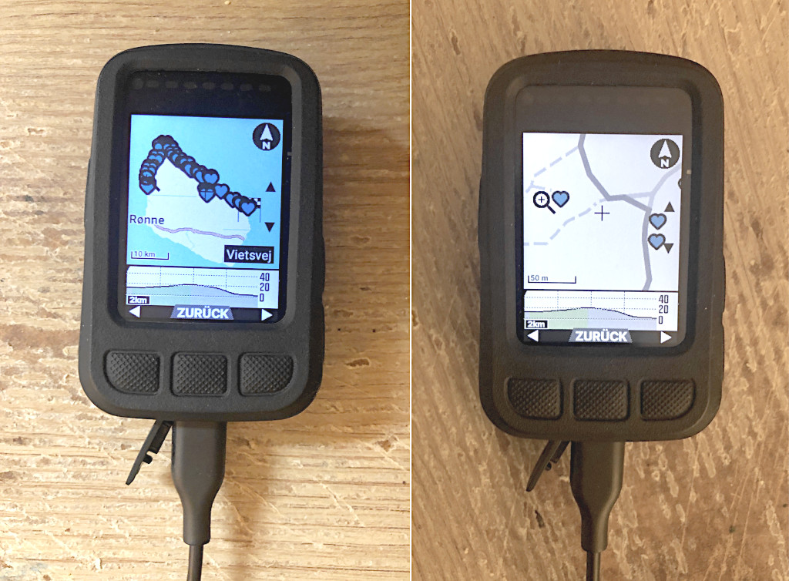

# Wahoo Elemnt Bolt v2 Utils


## Disclaimer

1. Programs and info offered here are not official from Wahoo, but a private non-commercial project.
2. Use this project at your own risk: It may void your warranty, damage your device, cause unexpected issues.
3. Programs here are not tested everywhere, not particularly optimized or fault-tolerant


## Auto-generated Points of Interest with gpx2poi & poi2db

  
(my Bolt with a rubber protective cover)

Without POIs a distance/bikepacking cyclist might miss nearby food/water.

- Finding POIs in a 100 meter `--poi-radius-deg` along the route:  
	OpenStreetMap servers allow to query features within a geographic polygon (Overpass API).  
	`Gpx2poi` constructs a simplified polygon (a buffered line) from all the route points in a GPX file downloaded from Komoot or similar. 
	It receives hundreds of features for this polygon and writes them to `your_route.geojson`. 
- Getting POIs to the Bolt:  
	`Poi2db` adds these features as POIs to Bolt's "Save my location" table on the device. 
	The sqlite database file is accessible via Android Debug Bridge ADB (credit to [AndroidAndyUK](https://www.youtube.com/watch?v=Sl--gcJ95XM)).
	Poi2db always recreates the entire auto-POIs list from scratch given a list of geojson-files. 
	Program parameter `--delete` removes all auto-POIs without adding new ones. 
	Manual POIs are not touched.
- Pros:
	- POI-generation and updating Bolt only takes a few seconds (at least for the tested 60 km tours) and little disk space
	- you don’t need any other POI-capable device
- Cons / Known issues:
	- heart-icon only for different POI types; value 1 instead of 0 for "poiType" in the database had no effect, perhaps reversing BoltApp could give answers
	- at the moment, better restrict to either `--poi-types=food,water` or `--poi-types=camp`, not both so you know what to expect from a heart-icon
	- extra step: when updating routes in Komoot etc, you have to copy them to this project too and rebuild the POI list
	- no auto-POIs when detouring
- Requires:
	- Linux
	- Python 3 (with pip)
	- USB data cable connecting Bolt
	- `setup.sh` downloads all dependencies  (ADB, python-libs, ...) to the project's subdirectory `local`, so your system stays clean after deletion
- Other approaches:
	- adding POIs manually via smartphone companion app = pain
	- **self generated maps** with POI-symbols = best approach but nasty setup and regular generation needs lot of time and disk space.  
		If I am not mistaken, at the time of this text (Sept. 2025) it is also broken
		- https://www.heise.de/select/ct/2022/26/2230710050673252243
		- https://github.com/yokuha/Wahoo-maps
		- https://www.rennrad-news.de/forum/threads/aktuelles-kartenmaterial-f%C3%BCr-wahoo-elemnt-bolt-roam-elemnt-selbst-generieren.175315/
	- custom CUE hints in FIT or TCX (not GPX) files will give a text warning when approaching the point + water tap icon  
		- I can NEITHER reproduce that with FIT nor TCX on my Bolt (in non-riding route-map overview mode)
		- I read, appearance of icons is limited to a specific short distance from the route (poi2db isn't limited)
		- RwGPS premium feature? $$$
		- ```xml
			<CoursePoint> 
				<Name>Water</Name> 
				<Time>2023-10-19T17:13:09Z</Time> 
				<Position> 
					<LatitudeDegrees>x.xxxx</LatitudeDegrees> 
					<LongitudeDegrees>y.yyyy</LongitudeDegrees> 
				</Position> 
				<PointType>Water</PointType>   <!-- or: Food, Danger -->
				<Notes>Water!</Notes> 
			</CoursePoint>
			```
	- navigate to POIs with your smartphone when hungry/thirsty


## Wahoo Basics

- Bolt runs an old Android operating system which is accessible via USB-Cable and the _Android Debug Bridge_ (ADB) tool
- consider [WebADB](https://app.webadb.com) via Chrome browser (using WebUSB) when unable to install or run ADB for some reason 
	(though some security/privacy risk)
- Bolt authorizes ADB in debug mode:
	1. power up without USB-Cable plugged in, 
	2. press POWER+UP+DOWN simultan. (1 or 2 times)
	3. plug in cable
	4. check with `adb devices`
- Bolt supports file formats: 
	- FIT (newer Garmin binary with smaller filesize), annoyingly requires Garmin FIT SDK
	- [TCX](https://en.wikipedia.org/wiki/Training_Center_XML) (older easy Garmin plaintext XML)
	- GPX (easy plaintext XML)


## See Also

- my stared cycling tools on GitHub: https://github.com/stars/andre-st/lists/cycling
- screen recording on Wahoo devices: https://www.youtube.com/watch?v=dSMxnPvunco


